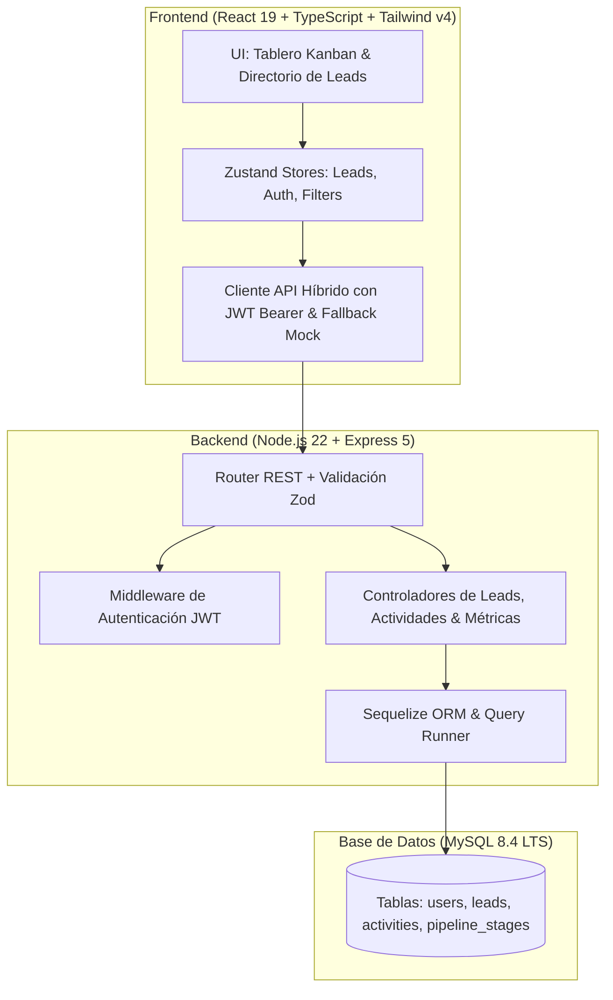

# LeadFlow CRM — Gestión de Leads B2B y Pipeline Comercial (Full Stack)

<div align="center">


**Plataforma web empresarial Full Stack de gestión de leads B2B, pipeline comercial interactivo tipo Kanban de 6 fases con Drag & Drop, panel lateral slide-over y analíticas de conversión con backend Express 5 y MySQL 8.4 LTS.**

[🚀 Demo en Vivo](https://alxnrocha.github.io/crm-leads/) • [📂 Repositorio en GitHub](https://github.com/alxnrocha/crm-leads)

</div>

---

## 🏛️ Arquitectura del Sistema



---

## ✨ Características Principales

### 🚀 Frontend (React 19 + TypeScript + Tailwind CSS v4)

- **Tablero Kanban de Ventas:** Visualización de las 6 fases del embudo comercial con Drag & Drop y sumas monetarias en tiempo real (€).
- **Directorio de Leads y Filtros:** Tabla densa con paginación, búsqueda instantánea y filtros combinados de origen y prioridad.
- **Panel Lateral Slide-Over:** Stepper de avance de fase comercial, acciones rápidas (llamadas, email) y timeline cronológico de actividades.
- **Métricas y KPIs en Tiempo Real:** Total del pipeline (€345k), tasa de conversión (42%) e ingresos cerrados.

### 🛡️ Backend & Datos (Node.js 22 + Express 5 + Sequelize + MySQL 8.4 LTS)

- **Autenticación JWT & BCrypt:** Endpoints seguros con control de roles (`admin`, `sales`).
- **Arquitectura RESTful Modular:** Controladores y middlewares con validación tipada mediante Zod.
- **Migraciones SQL Versionadas:** Runner que registra migraciones en `schema_migrations`.
- **OpenAPI 3.0.3 & Swagger UI:** Documentación interactiva de la API en `/api/docs`.

---

## 🗂️ Estructura del Proyecto

```text
11-crm-leads/
├── server/                        # Backend (Node.js 22 + Express 5 + Sequelize + MySQL)
│   ├── migrations/                # Migraciones SQL versionadas
│   ├── src/                       # Controladores, modelos, rutas, schemas
│   ├── .env.example
│   └── package.json
├── client/                        # Frontend (Vite + React 19 + Tailwind v4)
│   ├── src/                       # Componentes, vistas, stores, hooks
│   └── package.json
├── compose.yaml                   # Contenedor MySQL 8.4 LTS
├── package.json                   # Scripts monorepo
├── tsconfig.json
└── vite.config.ts
```

---

## 🚀 Instalación y Puesta en Marcha

### Prerrequisitos

- Node.js `>= 20.0.0`
- npm `>= 10.0.0`
- Docker Compose o MySQL 8.4 local

### Pasos de Ejecución

```bash
# 1. Clonar el repositorio
git clone https://github.com/alxnrocha/crm-leads.git
cd crm-leads

# 2. Instalar dependencias monorepo
npm install

# 3. Iniciar contenedor MySQL (opcional)
docker compose up -d

# 4. Iniciar entorno de desarrollo
npm run dev
```

_Frontend disponible en `http://localhost:5173` y API en `http://localhost:5000`._

---

## 🔑 Credenciales de Demostración

| Rol               | Correo Electrónico            | Contraseña   |
| ----------------- | ----------------------------- | ------------ |
| **Administrador** | `admin@leadflow.com`          | `Admin1234!` |
| **Comercial**     | `carlos.mendoza@leadflow.com` | `Sales1234!` |

---

## 🛠️ Tecnologías Utilizadas

| Capa              | Tecnología               | Aspectos Clave                                   |
| ----------------- | ------------------------ | ------------------------------------------------ |
| **Frontend**      | React 19, TypeScript 5.8 | Tablero Kanban dnd, panel slide-over interactivo |
| **Backend**       | Node.js 22, Express 5    | API REST, validación Zod y autenticación JWT     |
| **Base de Datos** | MySQL 8.4 LTS, Sequelize | Esquema relacional con claves foráneas e índices |
| **Estado Global** | Zustand 5.0              | Gestión reactiva de leads y filtros              |
| **Contenedores**  | Docker Compose           | Entorno de desarrollo aislado para MySQL         |
| **Despliegue**    | GitHub Pages             | Despliegue estático continuo y optimizado        |

---

<div align="center">
  <sub>Desarrollado con dedicación por <a href="https://github.com/alxnrocha">Alex Rocha</a> • Proyecto 11 del Portafolio Profesional Frontend.</sub>
</div>
