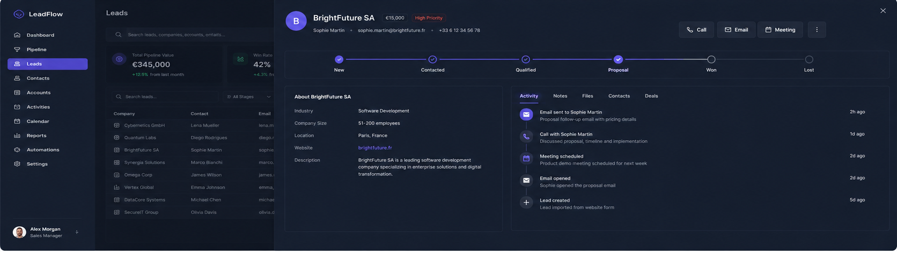

# LeadFlow CRM — Gestión de Leads B2B y Pipeline Comercial

[](https://github.com/alxnrocha/crm-leads/actions)
[](https://www.typescriptlang.org/)
[](https://react.dev/)
[](https://expressjs.com/)
[](https://www.mysql.com/)
[](https://tailwindcss.com/)
[](./LICENSE)

**LeadFlow CRM** es una solución web empresarial Full Stack diseñada para equipos comerciales y directores de ventas B2B. Proporciona un control exhaustivo del embudo de ventas mediante un tablero Kanban interactivo, una tabla densa de prospectos con filtros avanzados, un panel lateral de detalles con timeline de actividades comerciales y analíticas en tiempo real.

---

## 📸 Vista Previa del Sistema



---

## ✨ Características Principales

### 🚀 Frontend (React 19 + TypeScript + Tailwind CSS v4)

- **Tablero Kanban de Ventas:** Visualización interactiva de las 6 fases del embudo (`Nuevo`, `En Contacto`, `Calificado`, `Propuesta`, `Ganado`, `Perdido`) con soporte nativo de arrastrar y soltar (Drag and Drop) y sumas monetarias acumuladas en Euros (€).
- **Directorio de Leads y Filtros:** Tabla de alta densidad con ordenamiento, paginación, búsqueda instantánea por empresa/contacto/email y filtrado combinado por etapas y prioridades.
- **Modal de Creación y Edición:** Formularios con validación en tiempo real utilizando `React Hook Form` y esquemas estrictos de `Zod`.
- **Panel Lateral Deslizable (_Slide-Over Drawer_):** Vista detallada del prospecto con:
  - Stepper interactivo de progreso de etapas comerciales.
  - Botones de acción rápida para llamadas, correos y reuniones.
  - Ficha corporativa (industria, tamaño de empresa, ubicación y enlace web).
  - Timeline cronológico de interacciones con formulario de registro de llamadas, reuniones y notas.
- **Métricas y KPIs en Tiempo Real:** Tarjetas analíticas de valor total del pipeline (€345k), tasa de conversión (42%), ingresos ganados (€120k) y volumen de prospectos activos.
- **Tema Dark-Slate y Tokens `@theme`:** Interfaz moderna con estética dark navy/slate (`#0b0f17`), acentos Índigo/Violeta (`#6366f1`), paleta semántica por etapa y alternancia fluido de tema claro/oscuro.

### 🛡️ Backend & Datos (Node.js 22 + Express 5 + Sequelize + MySQL 8.4 LTS)

- **Autenticación JWT & BCrypt:** Endpoints seguros de registro, inicio de sesión y validación de perfil (`/api/v1/auth/me`) con control de roles (`admin`, `sales`).
- **Arquitectura RESTful Modular:** Controladores, middlewares de validación Zod (`validateBody`) y rutas independientes para `/auth`, `/stages`, `/leads`, `/activities` y `/metrics`.
- **Reordenamiento Transaccional:** Endpoint transaccional (`POST /stages/reorder`) respaldado por `sequelize.transaction` para sincronizar el orden del Kanban.
- **Documentación OpenAPI 3.0.3 & Swagger UI:** Interfaz interactiva de documentación y pruebas disponible en `/api/docs` y `/api/docs.json`.
- **Modelo Relacional Robusto:** DDL relacional con claves foráneas (`ON DELETE CASCADE / SET NULL`), índices de optimización y script de seed (`npm run seed`).

---

## 🏛️ Estructura del Monorepo

```text
11-crm-leads/
├── .github/workflows/ci.yml       # Pipeline CI (Lint, Test, Build)
├── client/                        # Frontend (Vite 8 + React 19 + Tailwind v4)
│   ├── src/
│   │   ├── __tests__/             # Pruebas unitarias de componentes con Vitest
│   │   ├── components/
│   │   │   ├── dashboard/         # Tarjetas de métricas (MetricCards)
│   │   │   ├── layout/            # Sidebar vertical, Header y DashboardLayout
│   │   │   ├── leads/             # LeadsTable, LeadFormModal y LeadDetailsDrawer
│   │   │   ├── pipeline/          # KanbanBoard, KanbanColumn y KanbanCard
│   │   │   └── ui/                # Primitivas accesibles (Button, Input, Card, Badge, Modal, Select)
│   │   ├── contexts/              # AuthContext y manejo de sesión
│   │   ├── hooks/                 # useAuth y useTheme
│   │   ├── services/              # api.ts (cliente HTTP) y pipeline.service.ts
│   │   ├── types/                 # auth.types.ts y pipeline.types.ts
│   │   ├── views/                 # LoginView, RegisterView y LeadsView
│   │   ├── App.tsx                # Shell de aplicación y route switcher
│   │   └── index.css              # Tokens @theme de Tailwind v4
│   └── vitest.config.ts
├── database/                      # Modelo de base de datos MySQL 8.4 LTS
│   ├── README.md                  # Diagrama DER (Mermaid) y diccionario de datos
│   ├── schema.sql                 # DDL de creación de tablas e índices
│   └── seed.sql                   # Datos de demostración en SQL
├── docs/screenshots/              # Capturas y previsualizaciones del sistema
├── server/                        # Backend (Node.js 22 + Express 5 + Sequelize)
│   ├── src/
│   │   ├── __tests__/             # Pruebas de integración con Supertest
│   │   ├── config/                # env.ts (validación Zod) y database.ts (Sequelize)
│   │   ├── controllers/           # auth, stage, lead, activity, metrics controllers
│   │   ├── docs/swagger.yaml      # Especificación OpenAPI 3.0.3
│   │   ├── middlewares/           # auth.middleware.ts y validate.middleware.ts
│   │   ├── models/                # User, Stage, LeadSource, Lead, Activity
│   │   ├── routes/                # auth, stage, lead, activity, metrics routes
│   │   ├── schemas/               # Zod validation schemas
│   │   ├── scripts/seed.ts        # Script de población de datos ORM
│   │   └── server.ts              # Servidor Express y montaje de Swagger
│   └── tsconfig.json
├── BLUEPRINT.md                   # Hoja de ruta y 18 issues completadas
├── DECISIONS.md                   # Registro de decisiones de ingeniería
└── package.json                   # Monorepo Workspaces y scripts globales
```

---

## ⚡ Guía de Inicio Rápido

### 1. Clonar e Instalar Dependencias

```bash
git clone https://github.com/alxnrocha/crm-leads.git
cd crm-leads
npm install
```

### 2. Configurar Variables de Entorno

Cree un archivo `.env` en `server/`:

```env
PORT=5000
NODE_ENV=development
DB_HOST=localhost
DB_PORT=3306
DB_USER=root
DB_PASSWORD=root
DB_NAME=crm_leads_db
JWT_SECRET=leadflow_enterprise_jwt_secret_key_2026_super_secure!
JWT_EXPIRES_IN=7d
CORS_ORIGIN=http://localhost:5173
```

### 3. Poblar Datos de Demostración

```bash
npm run seed
```

### 4. Iniciar en Modo Desarrollo

```bash
# Inicia tanto el backend (puerto 5000) como el frontend (puerto 5173) en paralelo
npm run dev
```

- **Frontend:** [http://localhost:5173](http://localhost:5173)
- **API Backend:** [http://localhost:5000/api/v1](http://localhost:5000/api/v1)
- **Documentación Swagger UI:** [http://localhost:5000/api/docs](http://localhost:5000/api/docs)

---

## 🔑 Credenciales de Demostración

| Usuario          | Rol                 | Correo Electrónico         | Contraseña     |
| :--------------- | :------------------ | :------------------------- | :------------- |
| **Alex Morgan**  | Comercial (`sales`) | `alex.morgan@leadflow.io`  | `Password123!` |
| **Carlos Gómez** | Director (`admin`)  | `carlos.gomez@leadflow.io` | `Password123!` |

_(La aplicación incluye botones de acceso directo de 1 clic en la pantalla de inicio de sesión)._

---

## 🧪 Pruebas Automatizadas y Calidad de Código

```bash
# Ejecutar todas las pruebas unitarias y de integración (12 pruebas)
npm test

# Ejecutar el linter Oxlint
npm run lint

# Formatear el código con Prettier
npm run format

# Compilar para producción (TypeScript + Vite)
npm run build
```

---

## 📄 Licencia

Este proyecto está bajo la Licencia MIT. Consulte el archivo [LICENSE](./LICENSE) para más detalles.
