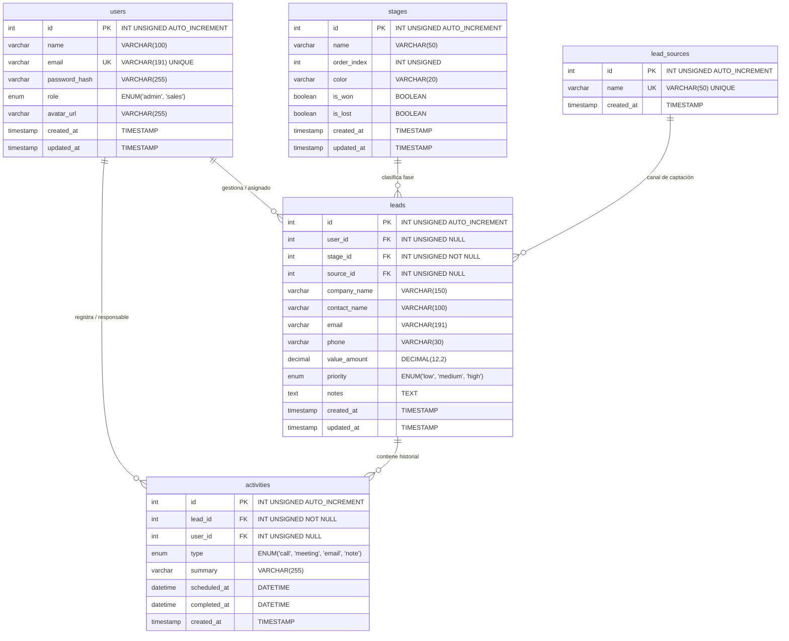

# Modelo de Base de Datos Relacional — LeadFlow CRM

**Motor RDBMS Objetivo:** MySQL 8.4 LTS
**Codificación:** `utf8mb4` (Collation: `utf8mb4_unicode_ci`)
**Archivos:** [`schema.sql`](./schema.sql) (DDL) y [`seed.sql`](./seed.sql) (Datos de demostración)

---

## 📊 Diagrama Entidad-Relación (ERD)



---

## 🗄️ Diccionario de Datos

### 1. `users` (Usuarios y Comerciales)

Almacena las credenciales de acceso para el equipo comercial y administradores con contraseñas cifradas vía `bcrypt`.

| Columna         | Tipo                    | Nulo | Descripción                                        |
| :-------------- | :---------------------- | :--- | :------------------------------------------------- |
| `id`            | `INT UNSIGNED`          | NO   | Clave primaria autoincremental                     |
| `name`          | `VARCHAR(100)`          | NO   | Nombre completo del representante                  |
| `email`         | `VARCHAR(191)`          | NO   | Correo electrónico único para inicio de sesión     |
| `password_hash` | `VARCHAR(255)`          | NO   | Hash BCrypt (10 rondas de salt)                    |
| `role`          | `ENUM('admin','sales')` | NO   | Rol de permisos del usuario (por defecto: `sales`) |
| `avatar_url`    | `VARCHAR(255)`          | SÍ   | URL de foto de perfil                              |
| `created_at`    | `TIMESTAMP`             | NO   | Fecha de creación del registro                     |
| `updated_at`    | `TIMESTAMP`             | NO   | Fecha de última modificación                       |

### 2. `stages` (Etapas del Pipeline)

Define el flujo comercial por el que transita un prospecto desde la captación hasta el cierre.

| Columna       | Tipo           | Nulo | Descripción                                                                                |
| :------------ | :------------- | :--- | :----------------------------------------------------------------------------------------- |
| `id`          | `INT UNSIGNED` | NO   | Clave primaria autoincremental                                                             |
| `name`        | `VARCHAR(50)`  | NO   | Nombre de la fase (`Nuevo`, `En Contacto`, `Calificado`, `Propuesta`, `Ganado`, `Perdido`) |
| `order_index` | `INT UNSIGNED` | NO   | Posición visual de la columna en el tablero Kanban                                         |
| `color`       | `VARCHAR(20)`  | NO   | Código hexadecimal del color de acento                                                     |
| `is_won`      | `BOOLEAN`      | NO   | Indica si representa una venta cerrada con éxito                                           |
| `is_lost`     | `BOOLEAN`      | NO   | Indica si representa una oportunidad descartada                                            |

### 3. `lead_sources` (Canales de Captación)

Clasificación del origen del prospecto para análisis de ROI en marketing.

| Columna      | Tipo           | Nulo | Descripción                                                                         |
| :----------- | :------------- | :--- | :---------------------------------------------------------------------------------- |
| `id`         | `INT UNSIGNED` | NO   | Clave primaria autoincremental                                                      |
| `name`       | `VARCHAR(50)`  | NO   | Nombre del canal (`Sitio Web`, `Google Ads`, `Meta Ads`, `Recomendación B2B`, etc.) |
| `created_at` | `TIMESTAMP`    | NO   | Fecha de registro                                                                   |

### 4. `leads` (Prospectos y Oportunidades)

Entidad central del CRM que representa el negocio en negociación con una empresa.

| Columna        | Tipo                          | Nulo | Descripción                                                     |
| :------------- | :---------------------------- | :--- | :-------------------------------------------------------------- |
| `id`           | `INT UNSIGNED`                | NO   | Clave primaria autoincremental                                  |
| `user_id`      | `INT UNSIGNED`                | SÍ   | Comercial asignado (`FK -> users.id`, `ON DELETE SET NULL`)     |
| `stage_id`     | `INT UNSIGNED`                | NO   | Etapa actual (`FK -> stages.id`, `ON DELETE RESTRICT`)          |
| `source_id`    | `INT UNSIGNED`                | SÍ   | Canal de origen (`FK -> lead_sources.id`, `ON DELETE SET NULL`) |
| `company_name` | `VARCHAR(150)`                | NO   | Razón social o nombre comercial de la empresa cliente           |
| `contact_name` | `VARCHAR(100)`                | NO   | Nombre de la persona de contacto                                |
| `email`        | `VARCHAR(191)`                | NO   | Correo electrónico de contacto                                  |
| `phone`        | `VARCHAR(30)`                 | SÍ   | Teléfono de contacto                                            |
| `value_amount` | `DECIMAL(12,2)`               | NO   | Valor comercial estimado de la oportunidad en Euros (€)         |
| `priority`     | `ENUM('low','medium','high')` | NO   | Prioridad comercial del prospecto                               |
| `notes`        | `TEXT`                        | SÍ   | Anotaciones internas y requerimientos técnicos                  |

### 5. `activities` (Historial de Interacciones)

Registro de auditoría y seguimiento comercial (llamadas, reuniones, correos y notas).

| Columna        | Tipo                                    | Nulo | Descripción                                              |
| :------------- | :-------------------------------------- | :--- | :------------------------------------------------------- |
| `id`           | `INT UNSIGNED`                          | NO   | Clave primaria autoincremental                           |
| `lead_id`      | `INT UNSIGNED`                          | NO   | Lead relacionado (`FK -> leads.id`, `ON DELETE CASCADE`) |
| `user_id`      | `INT UNSIGNED`                          | SÍ   | Comercial que realizó la acción (`FK -> users.id`)       |
| `type`         | `ENUM('call','meeting','email','note')` | NO   | Tipo de actividad realizada                              |
| `summary`      | `VARCHAR(255)`                          | NO   | Resumen de los acuerdos o resultados                     |
| `scheduled_at` | `DATETIME`                              | SÍ   | Fecha/hora programada para la actividad                  |
| `completed_at` | `DATETIME`                              | SÍ   | Fecha/hora en que se completó (NULL si está pendiente)   |

---

## ⚡ Índices de Rendimiento

- `idx_leads_user`: Optimiza filtros por comercial asignado.
- `idx_leads_stage`: Acelera la agrupación de tarjetas en el tablero Kanban.
- `idx_leads_company` y `idx_leads_email`: Búsqueda instantánea en la tabla de prospectos.
- `idx_activities_lead`: Carga rápida del timeline de un prospecto específico.

---

## 🚀 Instrucciones de Importación en MySQL 8.4 LTS

```bash
# 1. Crear el esquema
mysql -u root -p < database/schema.sql

# 2. Poblar datos iniciales
mysql -u root -p < database/seed.sql
```
